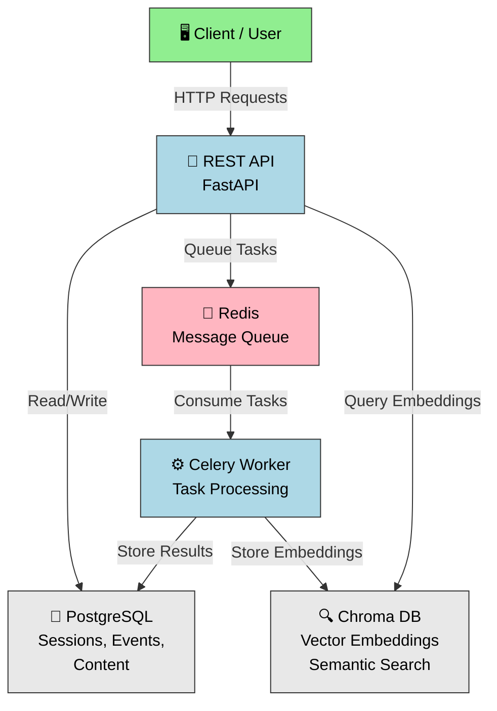

# SummarAIzer v2

AI-powered content processing system that transforms session transcriptions into comprehensive summaries, tags, key takeaways, visual diagrams, and AI-generated images from conference and event recordings.

## ⚡ Features

- **Automatic content generation** from transcriptions
- **LLM-powered workflows** with LangChain + LangGrap + OpenAI
- **Asynchronous task processing** via Celery
- **Semantic search** with embeddings (optional, can be disabled)
- **Full REST API** with OpenAPI docs

## 📊 Core Concepts

**Events** - Represent conferences, festivals, or other gatherings with multiple sessions.

**Sessions** - Individual talks, workshops, or presentations within an event.

**Content Workflows** - Pipeline that processes transcriptions to generate summaries, tags, key takeaways, diagrams, and images.

---

## 🚀 Quick Start

### Prerequisites
- Docker & Docker Compose (recommended)
- Or Python 3.11+, PostgreSQL 14+, Redis 6+ (for local development)

### Setup with Docker (Recommended)

**1. Start services:**
```bash
docker compose up -d
```

This starts:
- API server (port 7860) - http://localhost:7860
- Celery worker (background tasks)
- PostgreSQL (port 5432)
- Redis (port 6379)
- Chroma (port 8000, for embeddings)

**2. Initialize database:**
```bash
# Run database migrations
docker exec summaraizer alembic upgrade head

# Seed development data (creates default API user with token)
docker exec summaraizer python seed_dev_data.py
```

This creates a development API user with token for testing endpoints locally.

**3. Verify everything is running:**
```bash
docker compose ps
# All services should show "Up"

curl http://localhost:7860/health
# Returns: {"status": "ok"}
```

**4. Access the API:**
- **Swagger UI:** http://localhost:7860/docs
- **ReDoc:** http://localhost:7860/redoc

**5. Run tests:**
```bash
# Unit tests (fast, ~24 seconds)
docker exec summaraizer pytest tests/unit/ -v

# All tests with coverage
docker exec summaraizer pytest tests/unit/ --cov=app --cov-report=term-missing
```

**6. Stop services:**
```bash
docker compose down
```

### Setup for Local Development (Alternative)

If you prefer running without Docker:

```bash
# Create virtual environment
python -m venv venv && source venv/bin/activate

# Install dependencies
pip install -r requirements.txt

# Setup database
cp .env.example .env
# Edit .env with localhost URLs for local databases
alembic upgrade head
python seed_dev_data.py

# Terminal 1: API
uvicorn main:app --reload

# Terminal 2: Worker
celery -A app.async_jobs.celery_app worker --loglevel=info
```

### Multi-Service Development

If you're developing with other DLC services (hub, uff-sync):

```bash
cd ../hub
docker compose -f docker-compose.yml -f build/local/docker-compose.summaraizer.yml up -d
```

This shares postgres/redis/chroma with other services.

## 🔒 Authentication

All mutation endpoints (POST, PATCH, DELETE) require API key authentication via Bearer token:

```bash
curl -H "Authorization: Bearer YOUR_API_KEY" \
  -X POST http://localhost:7860/api/v2/events \
  -H "Content-Type: application/json" \
  -d '{"title": "My Event", "uri": "my-event", ...}'
```

**Authorization Model:**
- Create endpoints require authentication (user context)
- Update/Delete endpoints require resource ownership
- Unauthorized access returns `403 Forbidden`
- Missing/invalid auth returns `401 Unauthorized`

---

## 📡 API Endpoints

### Events
```
POST   /api/v2/events              Create event (requires auth)
GET    /api/v2/events              List events
GET    /api/v2/events/{id}         Get by ID
GET    /api/v2/events/by-uri/{uri} Get by URI
PATCH  /api/v2/events/{id}         Update (owner only)
DELETE /api/v2/events/{id}         Delete (owner only)
```

### Sessions
```
POST   /api/v2/sessions                    Create session (requires auth)
GET    /api/v2/sessions                    List (with filters)
GET    /api/v2/sessions/{id}               Get details
GET    /api/v2/sessions/by-uri/{uri}       Get by URI
PATCH  /api/v2/sessions/{id}               Update (owner only)
DELETE /api/v2/sessions/{id}               Delete (owner only)
```

### Content Management
```
GET    /api/v2/sessions/{id}/content                      Get available content
POST   /api/v2/sessions/{id}/content/transcription        Add transcription (owner only)
GET    /api/v2/sessions/{id}/content/{identifier}         Get content by ID
PATCH  /api/v2/sessions/{id}/content/{identifier}         Update content (owner only)
DELETE /api/v2/sessions/{id}/content/{identifier}         Delete content (owner only)
```

### Workflows
```
POST   /api/v2/sessions/{id}/workflow/{workflow_type}           Trigger generation (owner only)
  workflow_type: 'talk_workflow' (all steps) or individual steps
GET    /api/v2/sessions/{id}/workflow/{execution_id}     Check job status
```

Full OpenAPI documentation at `/docs` when running.

## 🧪 Testing

```bash
# Unit tests only (fast, ~24 seconds)
pytest tests/unit/ -v --cov=app

# Integration tests (requires running services)
pytest tests/integration/ -v

# All tests
pytest tests/ -v --cov=app --cov-report=term-missing

# Specific file
pytest tests/unit/test_crud_session.py -v

# Watch mode
ptw tests/unit/
```

**Test Structure:**
- `tests/unit/` - 153 isolated unit tests (CI runs these)
- `tests/integration/` - 43 API integration tests (manual runs)

---

## 📐 Architecture

The app uses a layered architecture with comprehensive authorization:

- **Routes** - REST API endpoints with authentication (FastAPI)
- **Security** - JWT/API key validation and ownership verification
- **CRUD** - Database operations (SQLAlchemy)
- **Schemas** - Request/response models (Pydantic)
- **Workflows** - Content generation pipelines (LangGraph)
- **Services** - LLM and storage integration
- **Async Jobs** - Background task queue (Celery)

### System Overview



### Workflow Execution
When a workflow is triggered:
1. Ownership verified (user must own session)
2. Task queued to Redis
3. Celery worker picks up task
4. Pipeline executes steps: summary → tags → takeaways → diagram → image
5. Results stored in database and S3
6. Status queryable via API

## 🏗️ Project Layout

```
.
├── app/
│   ├── async_jobs/          Celery tasks & queuing
│   ├── config/              Settings & environment
│   ├── constants/           Constants (embedding collections, etc.)
│   ├── crud/                Database CRUD operations
│   ├── database/            SQLAlchemy models
│   ├── events/              Event bus & handlers
│   ├── routes/
│   │   ├── session.py              Session CRUD endpoints
│   │   ├── session_content.py      Content management endpoints
│   │   ├── session_workflow.py     Workflow execution endpoints
│   │   ├── event.py                Event endpoints
│   │   ├── embedding.py            Semantic search endpoints (optional)
│   │   └── workflow_debug.py       Debug utilities
│   ├── schemas/             Pydantic request/response models
│   ├── security/            JWT & API key authentication
│   ├── services/            Business logic (embedding, search, etc.)
│   ├── utils/               Helper functions
│   └── workflows/           LangGraph pipeline definitions
├── tests/
│   ├── unit/                153 isolated unit tests (CI)
│   ├── integration/         43 API integration tests
│   ├── conftest.py          Shared pytest fixtures
│   └── __init__.py
├── .github/workflows/
│   └── tests.yml            GitHub Actions CI workflow
├── alembic/                 Database migrations
├── main.py                  FastAPI app entry point
├── requirements.txt         Dependencies
└── setup.cfg                Pytest configuration
```

## 📚 Stack & Dependencies

- **FastAPI** - Web framework
- **SQLAlchemy** - ORM
- **PostgreSQL** - Database
- **Celery + Redis** - Async task queue
- **LangChain** - LLM orchestration
- **LangGraph** - Workflow DAG
- **OpenAI** - Language models
- **Chroma** - Vector database for semantic search (optional)
- **boto3** - S3 storage
- **pytest** - Testing framework (196+ unit & integration tests)

---

## 🔒 Security & Authentication

**Authorization Model:**
- Every authenticated user can create events and sessions
- Only resource owners can modify or delete their resources
- Unauthorized access attempts return 403 Forbidden
- All mutation endpoints require valid API key authentication

**API Key Auth:**
```bash
# Create API key via admin panel or database
# Use in requests:
curl -H "Authorization: Bearer YOUR_API_KEY" \
  http://localhost:7860/api/v2/sessions
```

---

## 🔍 Semantic Search (Optional Feature)

**Embeddings & Search** can be enabled for semantic content discovery:

```bash
# Enable in .env
ENABLE_EMBEDDINGS=true

# Or disable for lightweight deployments (default)
ENABLE_EMBEDDINGS=false
```

**When enabled:**
- Sessions are automatically embedded into vector database when published (Chroma)
- `/api/v2/embeddings/search` endpoint available for semantic search
- `/api/v2/embeddings/refresh` manually trigger re-embedding
- Event handlers manage embedding lifecycle (create/delete/update)

---

## 🚀 Future Enhancements

- **Dynamic workflows** - Workflows adapt based on session format (quotes, workshops, talks)
- **Transcription generation** - Auto-generate transcriptions from media
- **Frontend UI** - Event/session management and content viewing

---

## 📄 License

Part of the ISy/DLC project suite.

**Version:** 2.0.0
