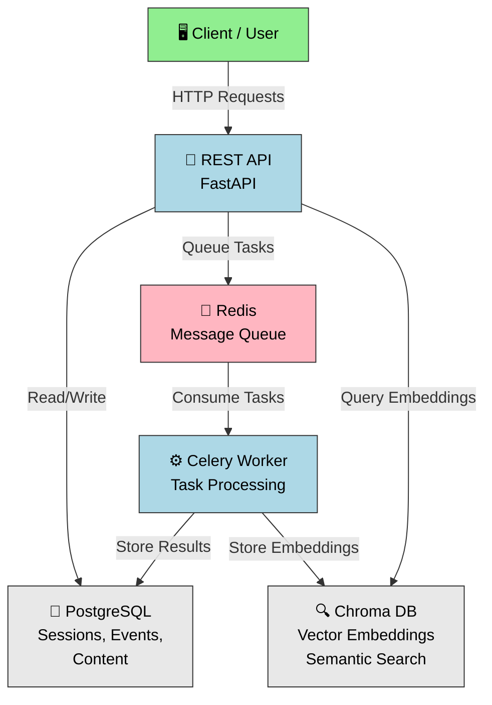

# SummarAIzer v2

AI-powered content processing system that transforms session transcriptions into summaries, tags, key takeaways, visual diagrams, and AI-generated images from conference and event recordings.

## ⚡ Features

- **Automatic content generation** from transcriptions
- **LLM-powered workflows** with LangChain + LangGrap + OpenAI
- **Asynchronous task processing** via Celery
- **Semantic search** with embeddings (optional, can be disabled)
- **Session recommender** with multi-query semantic search, preference learning, and optional LLM query refinement
- **Full REST API** with OpenAPI docs

## 📊 Core Concepts

**Events** - Represent conferences, festivals, or other gatherings with multiple sessions.

**Sessions** - Individual talks, workshops, or presentations within an event.

**Content Workflows** - Pipeline that processes transcriptions to generate summaries, tags, key takeaways, diagrams, and images.

---

## 🚀 Quick Start

### Prerequisites
- Docker & Docker Compose (recommended)
- Or Python 3.11+, PostgreSQL 14+, Redis 6+ (for local development)

### Setup with Docker (Recommended)

**1. Start services:**
```bash
docker compose up -d
```

This starts:
- API server (port 7860) - http://localhost:7860
- Celery worker (background tasks)
- PostgreSQL (port 5432)
- Redis (port 6379)
- Chroma (port 8000, for embeddings)

**2. Initialize database:**
```bash
# Run database migrations
docker exec summaraizer alembic upgrade head

# Seed development data (creates default API user with token)
docker exec summaraizer python seed_dev_data.py
```

This creates a development API user with token for testing endpoints locally.

**3. Verify everything is running:**
```bash
docker compose ps
# All services should show "Up"

curl http://localhost:7860/health
# Returns: {"status": "ok"}
```

**4. Access the API:**
- **Swagger UI:** http://localhost:7860/docs
- **ReDoc:** http://localhost:7860/redoc

**5. Run tests:**
```bash
# Unit tests (fast, ~24 seconds)
docker exec summaraizer pytest tests/unit/ -v

# All tests with coverage
docker exec summaraizer pytest tests/unit/ --cov=app --cov-report=term-missing
```

**6. Stop services:**
```bash
docker compose down
```

### Setup for Local Development (Alternative)

If you prefer running without Docker:

```bash
# Create virtual environment
python -m venv venv && source venv/bin/activate

# Install dependencies
pip install -r requirements.txt

# Setup database
cp .env.example .env
# Edit .env with localhost URLs for local databases
alembic upgrade head
python seed_dev_data.py

# Terminal 1: API
uvicorn main:app --reload

# Terminal 2: Worker
celery -A app.async_jobs.celery_app worker --loglevel=info
```

### Multi-Service Development

If you're developing with other DLC services (hub, uff-sync):

```bash
cd ../hub
docker compose -f docker-compose.yml -f build/local/docker-compose.summaraizer.yml up -d
```

This shares postgres/redis/chroma with other services.

## 🔒 Authentication

All mutation endpoints (POST, PATCH, DELETE) require API key authentication via Bearer token:

```bash
curl -H "Authorization: Bearer YOUR_API_KEY" \
  -X POST http://localhost:7860/api/v2/events \
  -H "Content-Type: application/json" \
  -d '{"title": "My Event", "uri": "my-event", ...}'
```

**Authorization Model:**
- Create endpoints require authentication (user context)
- Update/Delete endpoints require resource ownership
- Unauthorized access returns `403 Forbidden`
- Missing/invalid auth returns `401 Unauthorized`

---

## 📡 API Endpoints

### Events
```
POST   /api/v2/events              Create event (requires auth)
GET    /api/v2/events              List events
GET    /api/v2/events/{id}         Get by ID
GET    /api/v2/events/by-uri/{uri} Get by URI
PATCH  /api/v2/events/{id}         Update (owner only)
DELETE /api/v2/events/{id}         Delete (owner only)
```

### Sessions
```
POST   /api/v2/sessions                    Create session (requires auth)
GET    /api/v2/sessions                    List (with filters)
GET    /api/v2/sessions/{id}               Get details
GET    /api/v2/sessions/by-uri/{uri}       Get by URI
PATCH  /api/v2/sessions/{id}               Update (owner only)
DELETE /api/v2/sessions/{id}               Delete (owner only)
```

### Content Management
```
GET    /api/v2/sessions/{id}/content                      Get available content
POST   /api/v2/sessions/{id}/content/transcription        Add transcription (owner only)
GET    /api/v2/sessions/{id}/content/{identifier}         Get content by ID
PATCH  /api/v2/sessions/{id}/content/{identifier}         Update content (owner only)
DELETE /api/v2/sessions/{id}/content/{identifier}         Delete content (owner only)
```

### Workflows
```
POST   /api/v2/sessions/{id}/workflow/{workflow_type}           Trigger generation (owner only)
  workflow_type: 'talk_workflow' (all steps) or individual steps
GET    /api/v2/sessions/{id}/workflow/{execution_id}     Check job status
```

### Embeddings & Recommender
```
POST   /api/v2/sessions/recommend                  Get personalized session recommendations
GET    /api/v2/sessions/search/similar             Semantic similarity search
POST   /api/v2/sessions/query/refine               LLM-based query refinement
POST   /api/v2/sessions/{id}/embedding/refresh     Refresh session embedding (owner only)
```

Full OpenAPI documentation at `/docs` when running.

## 🧪 Testing

```bash
# Unit tests only (fast, ~24 seconds)
pytest tests/unit/ -v --cov=app

# Integration tests (requires running services)
pytest tests/integration/ -v

# All tests
pytest tests/ -v --cov=app --cov-report=term-missing

# Specific file
pytest tests/unit/test_crud_session.py -v

# Watch mode
ptw tests/unit/
```

---

## 📐 Architecture

The app uses a layered architecture:

- **Routes** - REST API endpoints with authentication (FastAPI)
- **Security** - JWT/API key validation and ownership verification
- **CRUD** - Database operations (SQLAlchemy)
- **Schemas** - Request/response models (Pydantic)
- **Workflows** - Content generation pipelines (LangGraph)
- **Services** - LLM and storage integration
- **Async Jobs** - Background task queue (Celery)

### System Overview



### Workflow Execution
When a workflow is triggered:
1. Ownership verified (user must own session)
2. Task queued to Redis
3. Celery worker picks up task
4. Pipeline executes steps: summary → tags → takeaways → diagram → image
5. Results stored in database and S3
6. Status queryable via API

## 🏗️ Project Layout

```
.
├── app/
│   ├── async_jobs/          Celery tasks & queuing
│   ├── config/              Settings & environment
│   ├── constants/           Constants (embedding collections, etc.)
│   ├── crud/                Database CRUD operations
│   ├── database/            SQLAlchemy models
│   ├── events/              Event bus & handlers
│   ├── routes/
│   │   ├── session.py              Session CRUD endpoints
│   │   ├── session_content.py      Content management endpoints
│   │   ├── session_workflow.py     Workflow execution endpoints
│   │   ├── event.py                Event endpoints
│   │   ├── embedding.py            Semantic search endpoints (optional)
│   │   └── workflow_debug.py       Debug utilities
│   ├── schemas/             Pydantic request/response models
│   ├── security/            JWT & API key authentication
│   ├── services/            Business logic (embedding, search, etc.)
│   ├── utils/               Helper functions
│   └── workflows/           LangGraph pipeline definitions
├── tests/
│   ├── unit/                isolated unit tests (CI)
│   ├── integration/         API integration tests
│   ├── conftest.py          Shared pytest fixtures
│   └── __init__.py
├── .github/workflows/
│   └── tests.yml            GitHub Actions CI workflow
├── alembic/                 Database migrations
├── main.py                  FastAPI app entry point
├── requirements.txt         Dependencies
└── setup.cfg                Pytest configuration
```

## 📚 Stack & Dependencies

- **FastAPI** - Web framework
- **SQLAlchemy** - ORM
- **PostgreSQL** - Database
- **Celery + Redis** - Async task queue
- **LangChain** - LLM orchestration
- **LangGraph** - Workflow DAG
- **OpenAI** - Language models
- **Chroma** - Vector database for semantic search (optional)
- **boto3** - S3 storage
- **pytest** - Testing framework (unit & integration tests)

---

## 🔒 Security & Authentication

**Authorization Model:**
- Every authenticated user can create events and sessions
- Only resource owners can modify or delete their resources
- Unauthorized access attempts return 403 Forbidden
- All mutation endpoints require valid API key authentication

**API Key Auth:**
```bash
# Create API key via admin panel or database
# Use in requests:
curl -H "Authorization: Bearer YOUR_API_KEY" \
  http://localhost:7860/api/v2/sessions
```

---

## 🔍 Semantic Search & Recommender (Optional Feature)

Both features require embeddings to be enabled:

```bash
# Enable in .env
ENABLE_EMBEDDINGS=true

# Or disable for lightweight deployments (default)
ENABLE_EMBEDDINGS=false
```

**When enabled:**
- Sessions are automatically embedded into Chroma when published
- `/api/v2/sessions/search/similar` — semantic similarity search
- `/api/v2/sessions/recommend` — personalized session recommendations
- `/api/v2/sessions/query/refine` — LLM-based query rewriting
- Event handlers manage the embedding lifecycle (create/update/delete)

### Session Recommender

The recommender returns a ranked list of sessions tailored to a user's interests.

### How it works

**1. Query embedding**

One or more free-text queries are accepted (`query: string | string[]`). Each query is embedded independently using the same model that embeds session content. When no query is provided, the recommender falls back to preference-based search using accepted/rejected session IDs.

**2. Optional LLM query refinement**

When `refine_query: true` is set, the queries are first passed through a LangChain structured-output agent that rewrites them for better retrieval intent and can infer hard filters (format, tags, location) when they are strongly implied by the query text. Trivially short queries (single word or fewer than 20 characters) are skipped to avoid unnecessary LLM calls.

```json
POST /api/v2/sessions/recommend
{
  "query": ["machine learning for beginners", "intro to neural networks"],
  "refine_query": true,
  "event_id": 42,
  "accepted_ids": [101, 102],
  "rejected_ids": [205],
  "filter_mode": "hard",
  "goal_mode": "similarity",
  "limit": 10
}
```

**3. Vector search (hard / soft filter modes)**

Each query embedding is run against Chroma with the active metadata filters.

- **Hard mode** (default) — Chroma `where` clause enforces all filters strictly. Only matching sessions are retrieved.
- **Soft mode** — The search runs without metadata filters from the start. Sessions receive a filter compliance penalty in the final score instead of being excluded.

When multiple queries are provided, results are merged and deduplicated — keeping the highest similarity score per session.

**4. Scoring**

Each candidate session receives a normalized composite score $\in [0, 1]$:

$$\text{score} = \frac{\sum_i s_i \cdot w_i}{\sum_i w_i}$$

| Component | Weight (default) | Description |
|---|---|---|
| **Semantic similarity** | 1.0 | Cosine similarity of session embedding to query embedding |
| **Liked cluster similarity** | 0.3 (`liked_embedding_weight`) | Similarity to the centroid of accepted session embeddings |
| **Inverted disliked similarity** | 0.2 (`disliked_embedding_weight`) | $1 - \text{sim}(\text{disliked})$ — penalises sessions close to rejected ones |
| **Filter compliance** | 0.1 (`filter_margin_weight`) | Ratio of active filters matched (only active in soft mode) |

All weights are request parameters and can be tuned per call.

After scoring, an optional diversity re-ranking step can be applied. When `diversity_weight > 0`, a greedy MMR-style pass re-orders the ranked candidates before the final cut to avoid clusters of near-identical results. This is separate from the weighted score above — it reorders already-scored candidates rather than contributing to their individual scores. Diversity is measured as a blend of embedding dissimilarity (40%) and categorical metadata novelty across tags, format, language, and speakers (60%).

**5. Goal modes**

- **`similarity`** (default) — Returns the top-N highest-scoring sessions globally.
- **`plan`** — Runs a scheduling optimizer after scoring that selects a non-overlapping set of sessions fitting within provided time windows, respecting minimum break times and filling schedule gaps.

---

## 🚀 Future Enhancements

- **Dynamic workflows** - Workflows adapt based on session format (quotes, workshops, talks)
- **Transcription generation** - Auto-generate transcriptions from media
- **Frontend UI** - Event/session management and content viewing

---

## 📄 License

Part of the ISy/DLC project suite.

**Version:** 2.0.0
